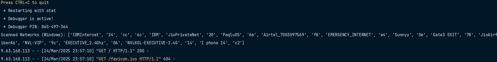
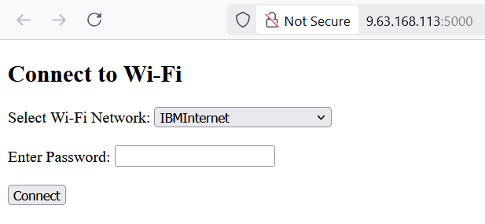
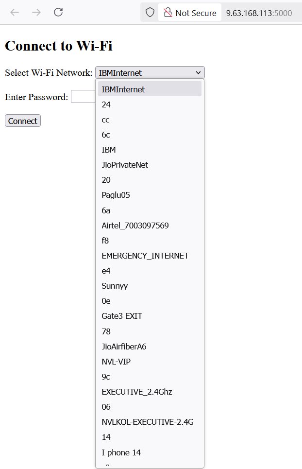

# VHOS-CONNECT-MANAGER
This is a framework based application for Vaani Hub OS. 

<h3>Initial setup application</h3>
This application would help user to conenct to the internet irrespective of system default network manager.

<h3> Application initiated</h3>
Application internal console
<br>-----------------------------</br>



While finding application opening page. 



Where we can see a list of all available networks into the drop down list. 



So practically into this application there is a scope which can help user periodically check & request for network connectivity. 
<br>--------------------------------------------</br>
```python .\network-setup.py```
<br></br>
Above command to initiate the application functionality to the user. 

<br></br>
There are multiple changes to be integrated into this app. Though this will a light weight application. So not much resource hunging operation will be included. 
